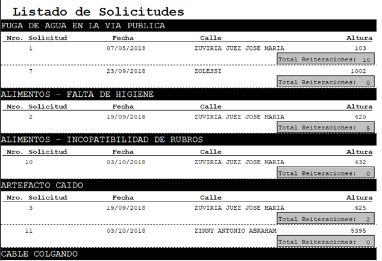

# VisualFox Pro - Complaints register

---
Once the project was created, I created the database, where I added 5 tables. To create the corresponding indexes I will analyse the data that each one will contain.

**Numbers->Numeric  
Characters->Character  
Dates->Date**  

In the table "segments" I created as main key "id_seg" and as regular key "id_street". In the table "categories" I created as main key "id_categor". In the table "reasons" I created as main key "id_reason" and as regular "id_category". In the table "persons" I created as main key "dni". In the table "streets" I created as main key "id_street".

Then create the tables applications and applicants with the indicated fields and with their corresponding data types, where data of new applications and applicants (persons corresponding to each application) will be stored.

For the table requests create as main key "id_solicit" and as normal keys "id_street" and "id_motivo". For the applicants table I created as main key what I called "soldni", which is a composite key between the fields "id_application" and "dni". And as normal keys "dni" and "id_solicit".

Once I have all the tables loaded, I pass them to the database and I made the corresponding joins between the indexes of each table.

## Data Base:

I created a form called "form1". Then I used the following controls with their respective code inside each event, or property.

Form:

Load:  
SET DEFAULT TO "C:\Users\....\FOX"  
SET DATE DMY  
SET CENTURY ON  
SET PROCEDURE TO program1  
PUBLIC he  
Unload: CLOSE TABLES  

Gird1(PERSONAS):
RecordSource: personas1 RecordSourceType: alias
AfterRowColChange: thisform.text10.Value="Solicitudes de "+ALLTRIM(personas1.apellido)+" "+ALLTRIM(personas1.nombre)+", DNI: "+ALLTRIM(STR(personas1.dni))
thisform.grid2.Refresh

Grid2(SOLICITANTES):  
ChildOrder: dni  
RecordSource:solicitantes  
RecordSourceType: alias  
ColumnCount: 5  
Column1-ControlSource: solicitudes.id_solicit  
Column2-ControlSource: solicitudes.fecha_recl  
Column3-ControlSource: motivos1.motivo  
Column4-ControlSource: ALLTRIM(calles.calle)+" "+ALLTRIM(STR(solicitudes.altura))  
Column5-ControlSource: solicitantes.reiteracio  
AfterRowColChange: thisform.text9.Refresh  

Grid3(MOTIVOS):
ChildOrder: id_categor
LinkMaster: categorias
RecordSource: motivos
ReordSourceType: alias
AfterRowColChange: thisform.text6.Value="Lugar del hecho para: "+ALLTRIM(motivos.motivo)
thisform.text6.Refresh
SELECT solicitudes
SET FILTER TO solicitudes.id_motivo=motivos.id_motivo

Click: Select motivos

Texto1(DNI):  
InteractiveChange: SELECT personas1  
SET FILTER TO  
SET FILTER TO ALLTRIM(STR(personas1.dni)) = ALLTRIM(thisform.text1.Value)  
thisform.grid1.Refresh  

Texto2(APELLIDO):
InteractiveChange: SELECT personas1
SET FILTER TO
SET FILTER TO personas1.apellido = ALLTRIM(thisform.text2.Value)
thisform.grid1.Refresh

Texto3(NOMBRE):  
InteractiveChange: SELECT personas1  
SET FILTER TO  
SET FILTER TO personas1.nombre = ALLTRIM(thisform.text3.Value)  
thisform.grid1.Refresh  

Texto4(TELEFONO):  
InteractiveChange: SELECT personas1  
SET FILTER TO  
SET FILTER TO ALLTRIM(STR(personas1.telefono)) = ALLTRIM(thisform.text4.Value)  

Texto6: (nothing)  
Texto7: (nothing)  
Texto8: (nothing)  
Texto10: (nothing)  

Boton1(Reiterar Solicitud):  
IF solicitantes.fecha_recl=DATE() then  
c=MESSAGEBOX("La solicitud ya fue reiterada el dia de hoy, ¿desea reiterarla nuevamente?",292)  
IF c=6 then  
SELECT solicitantes  
replace solicitantes.reiteracio WITH solicitantes.reiteracio+1  
thisform.grid2.Refresh  
ENDIF  
ELSE  
replace solicitantes.reiteracio WITH solicitantes.reiteracio+1  
replace solicitantes.fecha_recl WITH DATE()  
ENDIF  

ListBox1(CATEGORIAS):  
RowSource: categorias.categoria  
Type: -Alias  

Click: SELECT categorias  
thisform.grid3.Refresh  
thisform.grid2.Refresh  
InteractiveChange: thisform.grid2.Refresh  

Boton2(CARGA SOLICITUD):  

Cick: SELECT segmentos  
SET FILTER TO id_calle=calles1.id_calle  
LOCATE FOR thisform.text5.Value>=par_desde AND thisform.text5.Value<=par_hasta OR thisform.text5.Value>=imp_desde AND thisform.text5.Value>=imp_hasta  
IF NOT FOUND()  
MESSAGEBOX("La altura especificada no existe")  
ELSE  
SELECT solicitudes  
he=0  
ON ERROR DO eliminar_registro with ERROR(), he  
LOCATE FOR INT(thisform.text5.Value/100) = INT(solicitudes.altura/100) AND solicitudes.id_motivo=motivos.id_motivo  
IF FOUND()  
MESSAGEBOX("Ya existe una solicitud con el mismo motivo en la misma calle, por favor utilice la opcion reiterar o genere un nuevo solicitante",048)  
ELSE  
BEGIN TRANSACTION  
SET FILTER TO  
CALCULATE CNT(id_solicit) TO b  
b=b+1  
APPEND BLANK  
replace solicitudes.altura WITH thisform.text5.Value  
replace solicitudes.id_calle WITH calles1.id_calle  
replace solicitudes.id_motivo WITH motivos.id_motivo  
replace solicitudes.fecha_alta WITH DATE()  
replace solicitudes.id_solicit WITH b  
thisform.grid2.Refresh  
SELECT solicitantes  
APPEND BLANK  
replace solicitantes.dni WITH personas1.dni  
replace solicitantes.fecha_recl WITH DATE()  
replace solicitantes.id_solicit WITH b  
IF he=0 then  
END TRANSACTION  
MESSAGEBOX("¡Los datos fueron cargados exitosamente!",0)  
ELSE  
ROLLBACK  
MESSAGEBOX("¡Los datos no fueron cargados, ya que hubo un error!",0)  
ENDIF  
ENDIF  
ENDIF  
ON ERROR  
RETURN  

Boton3(MOSTRAR INFORME):  
Click: REPORT FORM report1 preview  

## Form:

## Dataenviroment:  

I created a program.prg called "program1", in which I introduced the following code:  
PROCEDURE delete_registry (he)  

he=1  
ON ERROR return  
ENDPROC  

Also I created a new report, called "report1", then create the data environment of the report.  

In order for the list to be displayed correctly, you must enter the tables in an order, so that the alias is the requests table. Since it is important to me that the requests for each reason are displayed.  For this, I had to group them by reasons (Data Grouping). After that, I proceeded to the creation of the form, with the help of the form controls.  

## Report Dataenviroment:  

## Report:  

